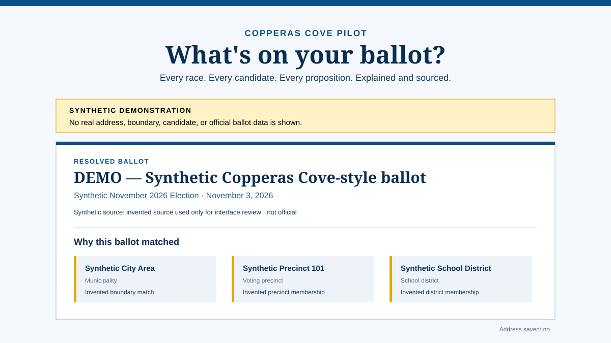

# What's on My Ballot

[](https://github.com/xavierwells/BallotApp/actions/workflows/ci.yml)

A privacy-first, provenance-first platform for finding and explaining local ballots. The Copperas Cove, Texas pilot is being built as a public website and a documented civic-data API that can later support other communities or self-hosted installations.

> [!IMPORTANT]
> This project is under active development. The interface can demonstrate ballot resolution, and reviewed geographic browse estimates are available, but the November 2026 official ballot is not yet published from the application. Synthetic content is always labeled and must never be mistaken for election information.



_Synthetic interface preview. The names, boundaries, ballot, and source shown above are invented for testing._

## What makes this project different

- **No voter-profile database.** Submitted addresses, browser coordinates, and other voter PII are request-scoped and discarded.
- **Evidence is part of the data model.** Claims and ballot items are connected to source documents, checksums, citations, and verification events.
- **Ambiguity is visible.** The resolver fails closed or presents multiple possibilities instead of guessing an exact ballot.
- **Useful beyond the website.** Versioned FastAPI endpoints publish OpenAPI, Swagger UI, and ReDoc documentation.
- **Portable by design.** The current modular monolith runs with Docker Compose and has a path to bare-metal and Rancher-compatible Kubernetes deployment.
- **Source and dependency review.** External services, datasets, and libraries must pass the project's license, terms, cost, privacy, and retention review.

## Current capabilities

| Capability | Status |
| --- | --- |
| Public Next.js entry page | Working |
| Address and browser-location resolution contracts | Working; real election selection awaits approved data/configuration |
| ZIP, city, and county browsing contracts | Working; reviewed ZIP 76522 Census estimate is available |
| PostgreSQL/PostGIS provenance schema | Operator confirmed the 015–016 workflow; migrations through `018_shared_race_reviews` are ready for database testing |
| Versioned official-ballot manifest intake | Draft-only foundation implemented |
| Texas 2026 certification staging | Bell, Coryell, and Lampasas: 108 race entries / 216 candidate entries; private PDF downloaded and checksum-matched; human review pending |
| Publication safeguards | Citations plus current-content staff review: one human for official facts, two for interpretive content; publication UI still pending |
| Synthetic resolved, ambiguous, and source-conflict scenarios | Available for development review |
| Editorial login and verification dashboard | Three private county tasks loaded; section decisions/corrections, shared race reviews and separate county-source confirmation implemented |
| Published November 2026 ballot content | Awaiting review, ballot styles, local contests, and authoritative applicability evidence |

See the [delivery backlog](docs/PRODUCT_DELIVERY_BACKLOG.md), [launch scope](docs/LAUNCH_SCOPE_2026.md), and [human action register](docs/HUMAN_ACTION_REGISTER.md) for the detailed state of the work.

The latest operator-reported database/container tests returned **85 passed,
10 warnings**, followed by successful setup of three private county tasks.
Setup and test results do not constitute editorial review.
The [verification workflow](docs/EDITORIAL_VERIFICATION_WORKFLOW.md)
provides setup commands for the new source-comparison workspace. Draft loading
does not require completed review; public publication does.

Latest engineering checks: **142 passed, 13 skipped, 1 warning** (no local
PostGIS), five frontend unit tests passed, production web build passed, and
mocked browser review/correction and shared-review flows passed on desktop and mobile.
Migration 018's database-backed integration and operator acceptance remain pending.

## Architecture

```text
Browser
  ├── Next.js web application
  └── FastAPI / OpenAPI service
          ├── PostgreSQL + PostGIS (civic, spatial, and provenance data)
          ├── private source-document storage
          └── Valkey (reserved for caching/background work)
```

This is intentionally a **modular monolith**, not a microservice system. Organization and publication boundaries leave room for future hosted tenants, while a self-hosted installation can operate as a straightforward single-tenant stack. Read the [architecture decision](docs/ARCHITECTURE.md) for the boundaries and deliberately deferred complexity.

## Run locally with Docker

Prerequisites: Docker Desktop or Docker Engine with Compose v2, plus Git. `make` is optional; the equivalent Docker commands are shown below.

```powershell
git clone https://github.com/xavierwells/BallotApp.git
cd BallotApp
Copy-Item .env.example .env
```

Replace `POSTGRES_PASSWORD` in `.env` with a strong local value, then start the stack:

```powershell
docker compose up --build
```

| Service | Local URL |
| --- | --- |
| Web application | <http://localhost:3000> |
| Staff review workspace | <http://localhost:3000/editorial> (provisioned account required) |
| Swagger UI | <http://localhost:8080/docs> |
| ReDoc | <http://localhost:8080/redoc> |
| API readiness | <http://localhost:8080/api/v1/health/ready> |

The one-shot `migrate` container applies pending database migrations and exits successfully before the API starts. That exited state is expected.

For bare-metal, production Compose, and Kubernetes guidance, see [Deployment](docs/DEPLOYMENT.md).

## Test and verify

Run the API, manifest, and OpenAPI contract tests in the pinned test image:

```powershell
make api-test
```

Without `make`:

```powershell
docker build --target test --tag ballot-api-test apps/api
docker run --rm --mount type=bind,source="${PWD}/data",target=/app/data,readonly ballot-api-test
```

The PostgreSQL migration integration test is skipped unless `TEST_DATABASE_URL`
points to an isolated test database. CI is configured to supply its own PostGIS
service; never point migration tests at the working pilot database.

To run all database-backed tests against a separate, temporary PostGIS service:

```powershell
docker compose --profile tests run --build --rm api-test
docker compose --profile tests stop test-postgres
```

Build the production web application:

```powershell
docker build --tag ballot-web apps/web
```

CI additionally checks direct-dependency approvals, locked Python and Node dependencies, high/critical vulnerabilities, secrets, configuration, licenses, production images, and SPDX SBOM generation. See [CI quality gates](docs/CI_QUALITY_GATES.md).

## API and data workflow

Public endpoints are currently versioned under `/api/v1`. Ballot discovery includes:

- `POST /api/v1/ballots/resolve` — ephemeral address resolution;
- `POST /api/v1/ballots/resolve-location` — ephemeral browser-coordinate resolution;
- `GET /api/v1/ballots/browse` — non-exact ZIP, city, or county browsing.

The API contract and privacy/ambiguity states are described in [Ballot Discovery API](docs/BALLOT_DISCOVERY_API.md). Official documents enter through a checksum-pinned, citation-required, draft-only manifest workflow documented in [Official Ballot Import](docs/OFFICIAL_BALLOT_IMPORT.md).

For the downloaded Texas certification, see [Candidate Certification Staging](docs/CANDIDATE_CERTIFICATION_STAGING.md).
Load the already-downloaded certification and provision your staff account:

```powershell
docker compose run --rm -it api python -m app.cli.prepare_pilot_review --username xavier
```

It prompts privately for a passphrase. Then sign in at `/editorial`, compare
source pages, choose Accept or Flag per section, and use **Submit review** at the
bottom to save. Flags have their own notes and optional typed corrections.
Corrected sections need a later acceptance; unchanged section reviews are
preserved. [Shared race reviews](docs/SHARED_RACE_REVIEW.md) avoid repeated name/party
checks across counties while retaining a separate county-source confirmation.
**Import reviewed county** creates unpublished civic records only.
Certification `--apply` also requires these database-backed
reviews; it is not an approval bypass. See the [staff API](docs/EDITORIAL_API.md).

## Project guardrails

1. Never persist or log submitted voter addresses or browser coordinates.
2. Never silently convert a coarse geographic match into an exact-ballot claim.
3. Never publish ballot items without source-page citations and current-content human review. Official facts need one reviewer; interpretive material needs two distinct humans.
4. Update OpenAPI documentation and automated tests with every API change.
5. Review every dependency, dataset, and external API before use; “free tier” does not establish acceptable licensing.
6. Keep the system simple until a real requirement justifies additional tenant or service infrastructure.

Read [Guardrails](docs/GUARDRAILS.md), [Privacy](docs/PRIVACY.md), the [source registry](docs/SOURCE_REGISTRY.md), and [third-party notices](THIRD_PARTY_NOTICES.md) before adding data or dependencies.

## Repository map

```text
apps/web/           Next.js public interface
apps/api/           FastAPI service, migrations, CLI imports, and tests
data/               Reviewed manifests and non-secret import inputs
docs/               Product, architecture, provenance, privacy, and operations
governance/         Machine-readable approval records
infra/kubernetes/   Rancher-compatible Kubernetes manifests
scripts/            Policy and dependency checks
compose.yaml        Local and single-server stack
```

## Contributing right now

The project is still establishing its authoritative pilot dataset and editorial workflow. Before opening a data or dependency change:

- check the [human action register](docs/HUMAN_ACTION_REGISTER.md) for work that requires an official or reviewer;
- record source terms and permitted use before importing material;
- use synthetic fixtures for tests, never real voter data;
- keep all public claims connected to provenance.

Terminology is centralized in the [project glossary](docs/GLOSSARY.md). Product positioning—including overlap with VOTE411 and the historical civic-data opportunity—is documented in [Product Positioning and Validation](docs/PRODUCT_POSITIONING_AND_VALIDATION.md).
