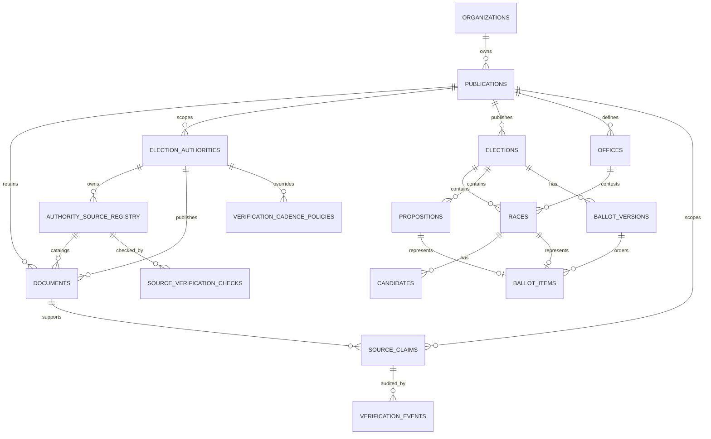

# Provenance-first data model

This is the required first migration boundary, before any candidate, proposition, or ballot data is persisted. It is implemented by Alembic migration `001_provenance_core` and is deliberately forward-only: restoring a verified backup is the recovery route for a destructive rollback.

## Apply and verify

Compose runs the migration before the API starts. To run it explicitly:

```sh
docker compose run --rm migrate
```

The migration integration test applies the schema to a new PostgreSQL database, verifies the required tables, enums, and triggers, and proves a second upgrade is idempotent. It uses `TEST_DATABASE_URL` and therefore runs in CI against an isolated PostgreSQL service.

## Schema map



## Minimum tables

```text
documents
  └── source_claims
        ├── candidates
        ├── ballot_items
        └── propositions

elections
  └── ballot_versions
        └── ballot_items

verification_events
```

| Table | Purpose | Required audit fields |
| --- | --- | --- |
| `documents` | Original authoritative/public documents and retrieval metadata | source URL, publisher, retrieved at, document date, checksum |
| `election_authorities` | Bodies that administer or authoritatively publish election records | publication, stable slug, type, official website, lifecycle status |
| `authority_source_registry` | External source endpoints and their approval state | authority, direct URL, terms/license, retention/redistribution review, reviewer/date |
| `verification_cadence_policies` | Adjustable source-review timing at organization, publication, or authority scope | scope, stage intervals, updater, timestamps |
| `source_verification_checks` | Immutable record of a source re-check and its next due time | source, outcome, checker, checked/next-check times |
| `source_claims` | A single publishable factual assertion or attributed statement | claim text, claim type, source/document/page, status, confidence |
| `verification_events` | Independent verification and correction history | verifier role, action, timestamp, before/after values |
| `elections` | Election authority and event | authority, election date, jurisdiction |
| `ballot_versions` | A time-bounded official ballot style | official source, retrieved at, publication/verification status |
| `ballot_items` | Ordered entries on one ballot version | race/proposition type, sequence, source citation |
| `candidates` | A person running in a specific race | canonical name, office/race reference, candidate-status source |
| `organizations` / `publications` | Future organization and publication isolation without an early multi-tenant deployment | UUID owner, stable slug, creation time |
| `offices` / `races` | Structured contests that appear on an election ballot | election and office references, ballot title, seats available |
| `propositions` | Official text for non-race ballot entries | official document reference and page citation |

## Non-negotiable fields

- A published claim has a required source document, a verification time, and a linked `verification_event`; a deferred PostgreSQL constraint rejects publication without that event.
- No published candidate fact is an unlinked column value. It must be represented by at least one `source_claim`.
- Claim types distinguish verified fact, candidate statement, editorial analysis, and community tip.
- Documents and verification events are immutable immediately. Published claims and published ballot versions are immutable; corrections create a superseding revision and `verification_event`.
- Claims include editorial status (`draft`, `needs_review`, `verified`, `published`, `retracted`, `superseded`), confidence, and a visible “last verified” time.
- Candidate responses are source documents/claims, not automatically verified facts.
- The schema stores no voter addresses, geocodes, or other voter-entered PII.
- Every accepted source artifact is retained privately. A document defaults to
  `metadata_only` public access; a visible copy requires an approved source
  review that explicitly permits it.

The physical schema may evolve, but these relationships and audit properties may not be bypassed for speed.
